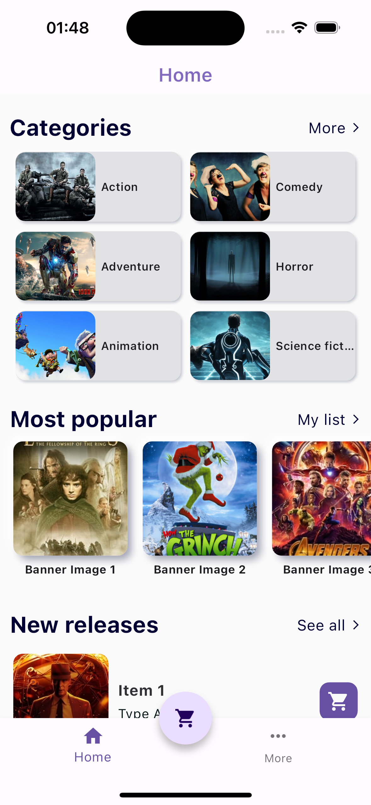
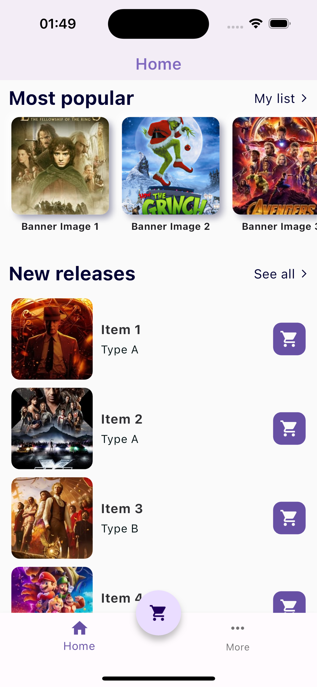
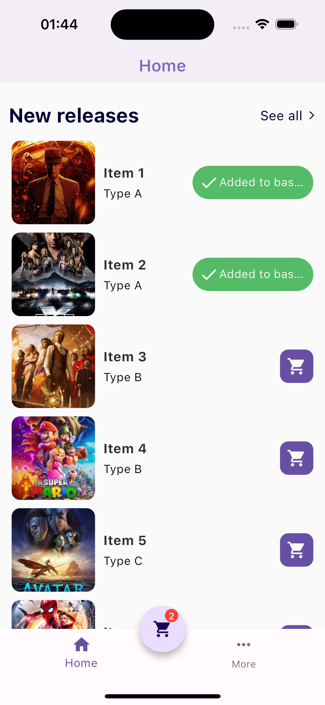

# Mobile Flutter Case 

## Süre: 
Uygulamanın 4 gün içerisinde tamamlanmasını bekliyoruz. 

## Amaç: 
Verilen dummy Api ve ux tarımları kullanılarak flutter grup listeleme ve seçim bottom sheet sayfalarının bulunduğu uygulama geliştirmek. 


## Fonksiyonel  Gereklilikler: 
- Flutter ve Dart son versiyonları kullanılmalıdır.
- Sayfaların ui tasarımı konusunda istediğiniz aksiyonu alabilirsiniz. 
- Liste itemları üzerinde seçim özelliği eklenmeli ve bu seçimler bottom sheet içerisinde gösterilmeli. 
- Uygulama crash free olması beklenmektedir.


## Olması Güzel Gereklilikler: 
- Animasyon ve Geçişler
- En az 1 Custom Widget 
- Unit Test (%100 coverage beklenmemektedir.)

## Beklentimiz: 
- State management kütüphanelerinden birini kullanılmalı. Tercihen(flutter_bloc-qubit, provider, mobx)
- Temiz mimari ve okunabilir kod. (SOLID Principles)
- Material tasarım ilkelerine göre ui uygulanmalı. 
- Compile edilebilir kod. 
- Olabildiğince açık yorum satırları. 
- Servis ve ui katmanının birbirinden ayrılması. 

## Api: 
```
https://intertechtr.github.io/interview.json
```

## Not: 
- Servis katmanı ve diğer ui komponentleri için third party library kullanılabilir.
- Bu ekranlar örnek ekranlardır, sizden tasarımları kendinize göre ui kullanarak geliştirmenizi bekliyoruz.


## RESULTS: 
<table border="1">
    <tr>
        <td>
            
        </td>
        <td>
            
        </td>
        <td>
            
        </td>
    </tr>
     <tr>
        <td>
            
        </td>
        <td>
            
        </td>
        <td>
            
        </td>
    </tr>
</table>

## GIF 
<table border="1">
    <tr>
        <td>
            
        </td>
        <td>
            
        </td>
        <td>
            
        </td>
    </tr>
    
</table>
